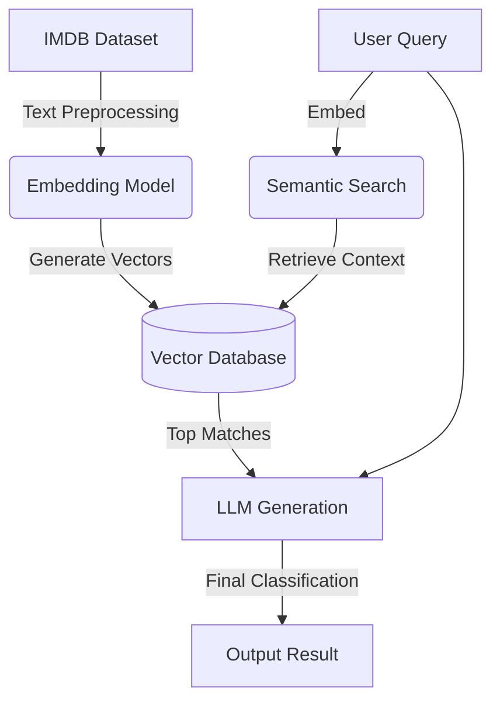

# 🎬 IMDB RAG Movie Classifier

> An intelligent Retrieval-Augmented Generation (RAG) system for classifying movies and extracting semantic insights from IMDB data.

[]()
[]()

## 🧠 Overview

This project implements a Natural Language Processing (NLP) pipeline that combines semantic embeddings with LLM-based generation to classify movie genres and extract deeper meaning from movie descriptions and reviews. 

Instead of relying solely on keyword matching, the RAG architecture allows the system to understand the context and semantic similarity between different movies.

## 🏗️ Architecture



## ✨ Features

- **Semantic Search:** Find movies based on conceptual similarity rather than exact keyword matches.
- **Genre Classification:** Accurately predict multiple genres based on plot summaries.
- **RAG Pipeline:** Augments LLM prompts with retrieved knowledge for highly accurate insights without fine-tuning.
- **Jupyter Notebooks:** Includes step-by-step visualizations of the embedding space and model performance.

## 🚀 Getting Started

### Prerequisites
- Python 3.10+
- Jupyter Notebook

### Installation

```bash
git clone https://github.com/Saryal-Saeed/rag-movie-classifier.git
cd rag-movie-classifier
python -m venv venv
source venv/bin/activate  # On Windows: venv\Scripts\activate
pip install -r requirements.txt
```

### Running the Project

Open the provided Jupyter notebooks to interact with the pipeline:

```bash
jupyter notebook
```

## 📊 Results & Visualization

*(Add screenshots of your cluster visualization or classification metrics here)*

## 📄 License

This project is licensed under the MIT License - see the [LICENSE](LICENSE) file for details.
